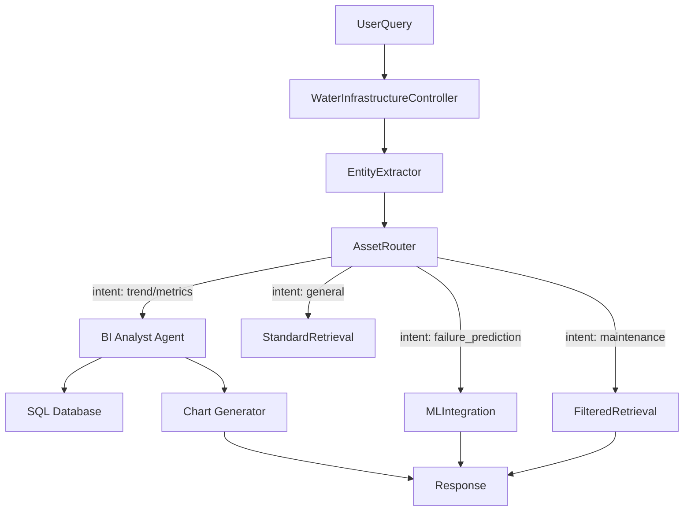

# Phase 8: Domain-Specific Extensions (Water Infrastructure)

**Duration:** Week 11 | **Priority:** P2 | **Status:** completed

## Context Links

- [Parent Plan](plan.md)
- [Phase 4: Orchestration Engine](phase-04-orchestration-engine.md)
- [Phase 5: Verification & QC](phase-05-verification-quality-control.md)
- [Master Plan Reference](../../Cognita-enhancement-master-plan.md)

## Overview

Build water infrastructure intelligence: specialized query controller, asset-type detection, maintenance code understanding, and **Daily Operational Intelligence (BI)**. This phase transforms the system from a passive document search engine into an active data analyst that can chart trends and query daily metric logs.

## Key Insights

Domain requirements:

- **Daily Analysis Logs:** Mixed data (numeric metrics + text commentary) generated daily.
- **Trend Analysis:** "What is the leak probability trend for the last 7 days?" (Requires SQL).
- **Asset types:** pipes, pumps, valves, meters, sensors.
- **Temporal/Spatial:** Date ranges and geographic bounds.
- **Maintenance codes:** Domain-specific acronyms.

## Requirements

### Functional

- **BI / Analyst Agent:** Chat with structured daily results (SQL integration).
- **Data Visualization:** Generate JSON outputs for UI charts (Line/Bar).
- **Water Infrastructure Query Controller:** Route queries by asset type & intent.
- **Entity Extractor:** Detect assets, dates, locations, maintenance codes.
- **ML Integration:** Connect to failure prediction models.

### Non-Functional

- **Dual-Stream Ingestion:** Automatically split daily logs into SQL (metrics) and Vector (text).
- **Read-Only SQL Access:** Sandbox the LLM to prevent database modification.
- **Entity extraction < 100ms.**

## Architecture

### Module Structure

```text
backend/modules/
├── domain/
│   └── water/
│       ├── __init__.py
│       ├── entity_extractor.py
│       ├── asset_router.py
│       ├── temporal_parser.py
│       ├── spatial_filter.py
│       ├── ml_integration.py
│       ├── knowledge_base/
│       │   ├── __init__.py
│       │   ├── acronyms.py
│       │   ├── asset_taxonomy.py
│       └── bi/                  <-- NEW: Business Intelligence Module
│           ├── __init__.py
│           ├── ingestor.py      # Splits CSV/JSON into SQL + Qdrant
│           ├── sql_agent.py     # LangChain SQL Toolkit wrapper
│           └── visualizer.py    # Formats data for Streamlit charts
└── query_controllers/
    └── water_infrastructure/
        ├── __init__.py
        ├── water_infrastructure_controller.py
        └── schemas.py

data/
└── domain/
    └── water/
        ├── acronyms.json
        ├── maintenance_codes.json
        └── daily_logs/          # Landing zone for daily analysis files

```

### Query Flow



## Implementation Steps

### Task 8.1: Knowledge Base Setup (Day 1)

_(Standard JSON setup for acronyms and taxonomy)_

### Task 8.2: Entity Extraction (Days 2-3)

_(Regex and LLM based extraction for Assets, Dates, and Locations)_

### Task 8.3: Asset Router & ML Integration (Days 4-5)

_Update `asset_router.py` to detect "Data Analysis" intent._

```python
class WaterAssetRouter:
    def __init__(self, config):
        self.intent_patterns = {
            "bi_analytics": ["trend", "average", "total", "plot", "chart", "statistics", "how many"],
            "failure": ["fail", "leak", "burst", "risk"],
            # ... others
        }

    def classify_query(self, query: str, entities: WaterEntities) -> str:
        # Check if user wants numbers/trends
        if any(w in query.lower() for w in self.intent_patterns["bi_analytics"]):
            return "bi_analytics"
        # ... existing logic

```

### Task 8.4: Water Infrastructure Controller (Day 6)

**File:** `backend/modules/query_controllers/water_infrastructure/water_infrastructure_controller.py`

```python
from backend.modules.query_controllers.base import BaseQueryController
from backend.server.decorators import query_controller, post
from backend.modules.domain.water.entity_extractor import WaterEntityExtractor
from backend.modules.domain.water.asset_router import WaterAssetRouter
from backend.modules.domain.water.ml_integration import WaterMLIntegration
from backend.modules.domain.water.spatial_filter import SpatialFilter
from backend.modules.domain.water.bi.sql_agent import WaterSQLAgent
from backend.modules.domain.water.bi.visualizer import DataVisualizer

@query_controller("/water-infrastructure")
class WaterInfrastructureController(BaseQueryController):
    def __init__(self):
        super().__init__()
        self.entity_extractor = WaterEntityExtractor(
            llm_config=settings.DEFAULT_LLM_CONFIG,
            knowledge_base=WaterKnowledgeBase()
        )
        self.asset_router = WaterAssetRouter(settings.WATER_CONFIG)
        self.ml_integration = WaterMLIntegration(settings.WATER_ML_CONFIG)
        self.spatial_filter = SpatialFilter()

        # Initialize BI Agent
        self.bi_agent = WaterSQLAgent(
            db_uri=settings.WATER_DB_URI,
            llm=self._get_llm(settings.DEFAULT_LLM_CONFIG)
        )
        self.visualizer = DataVisualizer()

    @post("/answer")
    async def answer(self, request: WaterQueryInput) -> StreamingResponse:
        # 1. Extract domain entities
        entities = await self.entity_extractor.extract(request.query)

        # 2. Classify query and get strategy
        query_type = self.asset_router.classify_query(request.query, entities)
        strategy = self.asset_router.get_retrieval_strategy(query_type, entities)

        # 3. Route to specialized handler
        if query_type == "bi_analytics":
             # NEW: Route to BI Agent
            return await self._handle_bi_query(request, entities)

        elif query_type == "failure":
            return await self._handle_failure_query(request, entities, strategy)

        elif query_type == "maintenance":
            return await self._handle_maintenance_query(request, entities, strategy)

        elif query_type == "compliance":
            return await self._handle_compliance_query(request, entities, strategy)

        else:
            return await self._handle_general_query(request, entities, strategy)

    async def _handle_bi_query(self, request, entities):
        """Handles queries about trends, statistics, and daily metrics."""
        # 1. Query the SQL Agent
        raw_response = await self.bi_agent.query(request.query)

        # 2. Format for Visualization (if applicable)
        final_response = self.visualizer.format_response(raw_response)

        return final_response

    async def _handle_failure_query(
        self, request: WaterQueryInput, entities: WaterEntities, strategy: Dict
    ) -> StreamingResponse:
        # Get ML prediction if asset ID available
        ml_prediction = None
        if entities.asset_id:
            ml_prediction = await self.ml_integration.get_failure_prediction(
                entities.asset_id
            )

        # Retrieve similar failure cases
        vector_store = await self._get_vector_store(request.collection_name)
        retriever = await self._get_retriever(
            vector_store, strategy["retriever"], request.retriever_config
        )

        # Apply metadata filters
        if strategy.get("filters"):
            retriever = self._apply_filters(retriever, strategy["filters"])

        docs = await retriever.aget_relevant_documents(request.query)

        # Apply spatial filter if location specified
        if entities.location:
            docs = self.spatial_filter.apply_filter(docs, entities.location)

        # Generate answer combining docs and ML prediction
        answer = await self._generate_failure_answer(
            request.query, docs, ml_prediction, request.model_configuration
        )

        if request.stream:
            return StreamingResponse(
                self._sse_wrap(self._stream_failure_response(docs, answer, ml_prediction)),
                media_type="text/event-stream"
            )
        return {"answer": answer, "docs": docs, "ml_prediction": ml_prediction}

    async def _generate_failure_answer(
        self, query: str, docs: List[Document],
        ml_prediction: Optional[Dict], model_config: ModelConfig
    ) -> str:
        llm = self._get_llm(model_config)

        context = self._format_docs(docs)
        ml_context = ""
        if ml_prediction and ml_prediction.get("available"):
            ml_context = f"""
ML Failure Prediction:
- Failure Probability: {ml_prediction['failure_probability']:.1%}
- Estimated Time to Failure: {ml_prediction['time_to_failure_days']} days
- Risk Factors: {', '.join(ml_prediction['risk_factors'])}
"""

        prompt = f"""Based on the following information, answer the question about water infrastructure failure.

Historical Documents:
{context}

{ml_context}

Question: {query}

Provide a comprehensive answer combining historical data with predictions where available."""

        response = await llm.ainvoke(prompt)
        return response.content

```

### Task 8.5: Daily Operational Intelligence (BI) (Day 7)

**Goal:** Enable "Chat with your Data" for daily analysis logs.

**1. Create `backend/modules/domain/water/bi/ingestor.py**`
_Logic: Auto-process new daily files._

```python
import pandas as pd
from sqlalchemy import create_engine

class DailyResultsIngestor:
    def __init__(self, sql_engine, vector_store):
        self.sql_engine = sql_engine
        self.vector_store = vector_store

    async def ingest(self, file_path: str):
        # 1. Load Data
        df = pd.read_csv(file_path)

        # 2. Stream A: Metrics to SQL (For Trend Analysis)
        # Assuming columns: [date, asset_id, leak_prob, flow_rate, status]
        numeric_cols = ['date', 'asset_id', 'leak_prob', 'flow_rate', 'status']
        df[numeric_cols].to_sql('daily_analysis', self.sql_engine, if_exists='append')

        # 3. Stream B: Commentary to Vector Store (For Text Search)
        # Assuming columns: [date, asset_id, analyst_comments]
        documents = []
        for _, row in df.iterrows():
            doc = Document(
                page_content=row['analyst_comments'],
                metadata={
                    "type": "daily_log",
                    "date": row['date'],
                    "asset_id": row['asset_id'],
                    "source": "analyst_report"
                }
            )
            documents.append(doc)

        await self.vector_store.add_documents(documents)

```

**2. Create `backend/modules/domain/water/bi/sql_agent.py**`
_Logic: LangChain SQL Toolkit wrapper._

```python
from langchain_community.agent_toolkits import create_sql_agent
from langchain_community.utilities import SQLDatabase
from langchain_community.agent_toolkits.sql.toolkit import SQLDatabaseToolkit

class WaterSQLAgent:
    def __init__(self, db_uri: str, llm):
        self.db = SQLDatabase.from_uri(db_uri)
        self.agent = create_sql_agent(
            llm=llm,
            toolkit=SQLDatabaseToolkit(db=self.db, llm=llm),
            verbose=True,
            prefix="""
            You are a SEQ Water Data Analyst.
            Query the 'daily_analysis' table to answer questions about trends, averages, and counts.
            IMPORTANT:
            1. Always return the 'date' and 'value' if a trend is asked.
            2. Do not modify the database.
            3. Use the current date for 'today' calculations.
            """
        )

    async def query(self, user_input: str):
        return await self.agent.ainvoke(user_input)

```

**3. Create `backend/modules/domain/water/bi/visualizer.py**`
_Logic: Convert SQL output to Charts._

```python
class DataVisualizer:
    def format_response(self, agent_response: dict) -> dict:
        """
        Parses LLM output. If it contains a list of dates/values,
        flags it for rendering a Line Chart in the UI.
        """
        # (Simple heuristic implementation)
        if "trend" in agent_response.get("output", "").lower():
            return {
                "text": agent_response["output"],
                "visualization": {
                    "type": "line_chart",
                    "data": self._extract_series(agent_response["output"])
                }
            }
        return {"text": agent_response["output"]}

```

## Todo List

- [ ] Create domain module structure
- [ ] Create water knowledge base JSON files
- [ ] Implement WaterEntities schema & Extractor
- [ ] Implement TemporalParser & SpatialFilter
- [ ] Implement WaterAssetRouter
- [ ] **Implement BI Module (`ingestor`, `sql_agent`, `visualizer`)**
- [ ] **Implement WaterInfrastructureController (Integrated Logic)**
- [ ] Register controller in `__init__.py`
- [ ] Create dummy `daily_analysis.csv` for testing
- [ ] Write integration tests

## Success Criteria

- Entity extraction accuracy > 90%.
- **BI Agent correctly answers: "Show me the leak probability trend for Pipe-A last week."**
- **System generates a Line Chart JSON for trend queries.**
- Temporal parsing handles all common date formats.
- Controller routes queries correctly by type.

## Risk Assessment

| Risk                                   | Likelihood | Impact | Mitigation                                         |
| -------------------------------------- | ---------- | ------ | -------------------------------------------------- |
| Domain knowledge incomplete            | Medium     | Medium | Iterative KB updates                               |
| **SQL Injection / Data Hallucination** | Low        | High   | **Read-Only DB permissions; Strict System Prompt** |
| Entity extraction ambiguity            | Medium     | Medium | Confidence thresholds, LLM fallback                |

## Next Steps

After Phase 8:

- Phase 9 (Performance): Optimize SQL query speed and Vector caching.
- **Demo Day:** Showcase the "Chat with Data" feature using the dummy CSV logs.

```

```
